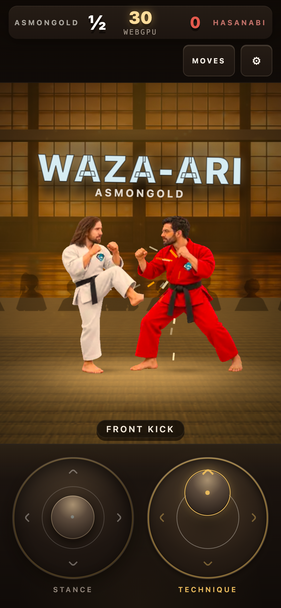
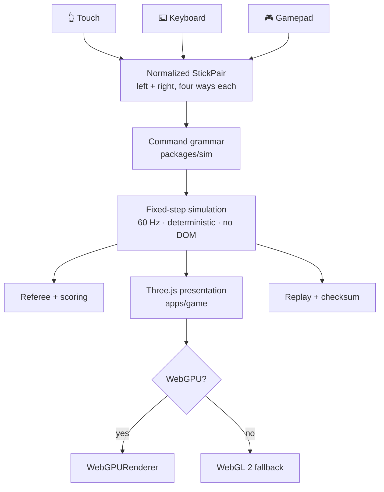

# 🥋 ShoeMoney Karate Kids

### **Two sticks. No buttons. One clean point.** 👊✨

[](LICENSE)
[](#-rendering)
[](#-mobile-first-means-mobile-first)
[](https://threejs.org/)

A browser reinterpretation of 1984 tournament karate: **no health bar, no combos**. One
valid strike ends the exchange, a referee calls half a point or a full point, and the
first fighter to two points takes the bout. Spacing and timing are the whole game.

> 🚧 **Phase 1 vertical slice.** Two fighters, one dojo, twenty techniques, referee
> scoring, deterministic replay. Not the campaign yet — see [Roadmap](#-roadmap).



---

## 📱 Mobile-first means mobile-first

The design baseline is a **390 × 844 portrait phone**. Desktop is the adaptation, not
the other way round. That decision is recorded, with its trade-offs, in
[ADR 0001](docs/adr/0001-mobile-first-twin-stick.md).

| | |
|---|---|
| 🕹️ **Two floating sticks** | Each one re-centres wherever your thumb lands, so you never look down to find it. |
| 🚪 **A software gate** | Glass has no detents. A dead zone, dominant-axis selection, and hysteresis rebuild the cabinet's four-way gate so a wobbling thumb never chatters between techniques. |
| 🎥 **A camera that breathes** | A tall viewport would shrink two fighters to dolls. The frame holds only the distance actually between them, dollying in as the exchange closes. |
| 🔌 **Every device is an adapter** | Touch, keyboard, and Gamepad all collapse to the same normalized four-way pair. The simulation never learns which one is driving. |

---

## 🎮 How to play

The **left stick is stance**. The **right stick is technique**. There are no attack buttons.

| Left stick alone | What happens |
|---|---|
| ◀ ▶ | Walk back / forward |
| ▲ | Jump |
| ▼ | Crouch |

Move the **right stick** out of neutral and you throw a technique. Where the **left
stick** is at that instant decides *which one* — four families × five qualifiers =
**20 techniques**, plus the four movement commands.

```
right ▶  →  lunge punch · jumping punch · crouching punch · stepping lunge punch · back fist
right ◀  →  reverse punch · somersault kick · crouching reverse punch · back kick · spinning back kick
right ▲  →  front kick · jumping front kick · rising knee · roundhouse kick · high block
right ▼  →  foot sweep · jumping sweep kick · low sweep · leg sweep · low block
```

The stick must pass back through neutral before the next technique fires, so holding a
direction never machine-guns.

**Keyboard:** `WASD` is the stance stick, arrow keys (or `IJKL`) are the technique stick.
**Gamepad:** both analog sticks, quantized to four ways.

### 🧑‍⚖️ How the referee scores

| Call | Worth | When |
|---|---|---|
| **WAZA-ARI** ½ | 0.5 | A clean contact with a half-value technique |
| **IPPON** ● | 1.0 | A full-value technique, **or** a counter — beating your opponent to the punch, landing while they're still winding up |
| **AIUCHI** | 0 | Both land on the same tick. Nobody scores, reset. |
| **BLOCKED** | 0 | An active block covering that height band |

Crouching ducks a **high** strike. Jumping clears a **low** one. First to **2 points**, or
the higher score when the 30-second clock runs out.

---

## 🏗️ Architecture



**The hard boundary:** `packages/sim` may not import Three.js, the DOM, audio, the
network, or any AI client. It takes normalized input frames and emits deterministic
events. That is what makes the replay checksum meaningful — and it is enforced by test,
not by good intentions.

| Package | What lives there |
|---|---|
| `packages/sim` | Clock, grammar, fighter state machine, hit resolution, referee, replay, CPU. Zero browser. |
| `packages/content` | Zod-validated move / fighter / arena / ruleset data. Importing it *is* the validation. |
| `apps/game` | Three.js presentation, input adapters, HUD, audio, the mobile layout. |
| `tools/` | Content and asset validators run by CI. |

---

## 🚀 Quick start

```bash
pnpm install
pnpm dev          # http://127.0.0.1:5173
```

| Command | Does |
|---|---|
| `pnpm dev` | Dev server with HMR |
| `pnpm build` | Production bundle |
| `pnpm test` | Simulation unit + soak tests (vitest) |
| `pnpm test:e2e` | Playwright, portrait phone + desktop |
| `pnpm validate:content` | Every grammar move has frame data, and nothing is orphaned |
| `pnpm validate:assets` | Every shipped asset has provenance |
| `pnpm check` | All of the above — run it before you call anything done |

### 🔧 URL switches

| Parameter | Effect |
|---|---|
| `?mode=dojo` | Training partner holds stance so you can drill |
| `?mode=classic` \| `pressure` \| `counter` | CPU archetype |
| `?renderer=webgl` | Force the WebGL 2 fallback path |
| `?seed=1337` | Seed the CPU, for reproducible bouts |

---

## 🖥️ Rendering

Three.js `WebGPURenderer` tries WebGPU and falls back to WebGL 2. **A missing WebGPU is a
fallback, never a refusal to run** — the backend in use is printed under the clock.

The simulation is renderer-independent, and there is a test that proves it: the same seed
run on both backends must produce the same checksum. If rendering ever leaks into game
state, that test goes red.

---

## ✅ Verify

```bash
pnpm check                              # typecheck, unit, content, assets
pnpm --filter @smkk/game test:e2e       # real touch events via CDP, on a 390×844 viewport
```

The end-to-end suite plays an actual bout with **nothing but two synthetic thumbs**,
dispatched through the browser's real input pipeline rather than fabricated in page
script. A build no thumb could play fails here.

---

## 🗺️ Roadmap

| Phase | State | Contents |
|---|---|---|
| **0 — proof** | ✅ | Twin-stick parser, referee state, deterministic replay, both renderer backends |
| **1 — vertical slice** | ✅ | Two fighters, dojo, 20 techniques, CPU archetypes, audio, mobile layout |
| **2 — MVP** | ⏳ | Local versus, three arenas, three classic challenges, replays UI, quality tiers, PWA shell |
| **3 — Version 1** | ⏳ | Championship Journey, 12 arenas, score attack, localization, full mix |

---

## ⚖️ Licence and rights

The source code and project-authored documentation are **MIT** — see [LICENSE](LICENSE).

**The MIT grant does not cover everything in this repository:**

- 🛡️ The **ShoeMoney emblem** on the fighters' gi is Jeremy Schoemaker's brand mark, used
  with permission and carved out of the MIT grant. See
  [`apps/game/public/brand/PROVENANCE.json`](apps/game/public/brand/PROVENANCE.json).
- 🚫 Nothing here grants any right to the **Karate Champ** name, logos, characters, cabinet
  art, or audio, or to any Data East / G-MODE intellectual property. This project ships
  **original assets only** and carries no ROM-derived material.

Details in [THIRD_PARTY_NOTICES.md](THIRD_PARTY_NOTICES.md) and
[docs/asset-provenance.md](docs/asset-provenance.md).

---

## 🤝 Contributing

[CONTRIBUTING.md](CONTRIBUTING.md) · [CODE_OF_CONDUCT.md](CODE_OF_CONDUCT.md) ·
[SECURITY.md](SECURITY.md)

Two rules worth repeating before you open a PR:

1. **`packages/sim` stays platform-free.** If your change makes it import a browser API,
   it belongs in `apps/game`.
2. **Add the test before you change command parsing, scoring, the timer, or the replay
   format.** Those four are the contract.
